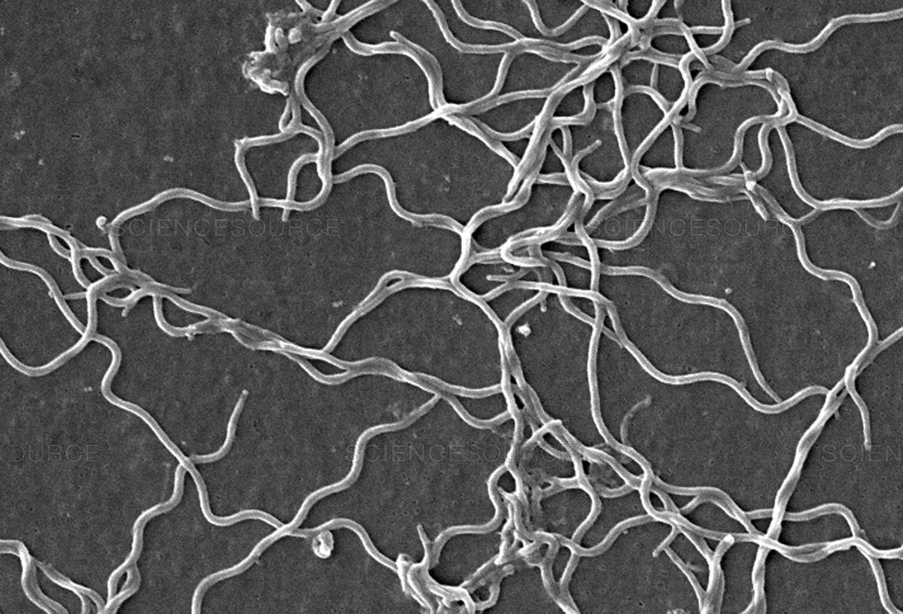

## Importing and preparing the data

Import "Sequences.csv".
```{r}
bseqs <- read.csv("Sequences.csv")
names(bseqs) <- c("Sequence.ID", "Sequence")
bseqs$Sequence <- as.character(bseqs$Sequence)
```

Count the numbers of each base pair in each of the three sequences. Store them in vectors As, Cs, Gs, and Ts. 
```{r}
As <- c()
for (i in 1:nrow(bseqs)){
  As[i] <- nchar(gsub("[^A]", "", bseqs[i,2]))
}

Cs <- c()
for (i in 1:nrow(bseqs)){
  Cs[i] <- nchar(gsub("[^C]", "", bseqs[i,2]))
}

Gs <- c()
for (i in 1:nrow(bseqs)){
  Gs[i] <- nchar(gsub("[^G]", "", bseqs[i,2]))
}

Ts <- c()
for (i in 1:nrow(bseqs)){
  Ts[i] <- nchar(gsub("[^T]", "", bseqs[i,2]))
}
```

Store these vectors as columns in the dataframe bseqs. 
```{r}
bseqs$Cs <- Cs
bseqs$Gs <- Gs
bseqs$As <- As
bseqs$Ts <- Ts

# Check to see if my counts for the individual nucleotides makes sense
test_lengths <- bseqs$Cs + bseqs$Gs + bseqs$As + bseqs$Ts
lengths <- c(nchar(bseqs$Sequence[1]), nchar(bseqs$Sequence[2]), nchar(bseqs$Sequence[3]))
identical(test_lengths, lengths)
```

Calculate %GC content and store it in bseqs. 
```{r}
bseqs$GC <- (Gs + Cs) / (Gs + Cs + As + Ts)
bseqs$pGC <- paste(signif(bseqs$GC * 100, digits = 3), "%")
```

## Sequences 

### Sequence 1: HQ433692.1

```{r}
bseqs$Sequence[1]
```

### Sequence 2: HQ433694.1

```{r}
bseqs$Sequence[2]
```

### Sequence 3: HQ433691.1

```{r}
bseqs$Sequence[3]
```

## Summary Tables

## Nucleotide breakdown
```{r message=FALSE}
library(knitr)
library(dplyr)

TableGC <- bseqs[c("Sequence.ID", "As", "Ts", "Gs", "Cs")]
kable(TableGC, caption="Table 1. Nucleotide breakdown per sequence", col.names = c("Sequence ID",
                                                                        "Total As", "Total Ts",
                                                                        "Total Gs", "Total Cs"))
```

## GC content

```{r}
TableGC <- bseqs[c("Sequence.ID", "pGC")]
names(TableGC) <- c("Sequence ID", "GC Content")
kable(TableGC, caption="Table 2. Percent GC content per sequence.")
```

## Bacteria information 
Wikipedia link for [*Borrelia burgdorferi*](https://en.wikipedia.org/wiki/Borrelia_burgdorferi)



## "GC_content.csv" analysis
```{r}
library(ggplot2)

dat <- read.csv("GC_content.csv")
dat$pGC <- dat$G + dat$C

ggplot(dat, aes(x = ID, y = pGC, colour = Species)) + 
  geom_point() + 
  theme_classic() +
  scale_y_continuous(name="% GC content") + 
  scale_x_discrete(name="Individual") + 
  theme(axis.title.x=element_text(),
        axis.text.x=element_blank(),
        axis.ticks.x=element_blank())

```

Figure 1. Percent GC content of 1000 specimens from three unknown species. 
